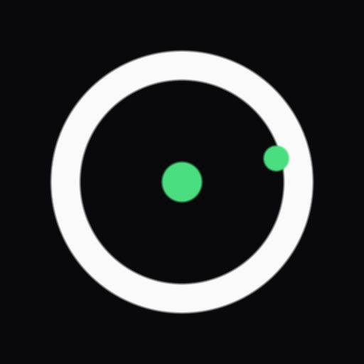

<p align="center">
  <a href="https://delexoo.github.io/OrbINT/">
    
  </a>
</p>

<h1 align="center">OrbINT</h1>

<p align="center">
  <strong>A local-first OSINT case file.</strong><br>
  Map every fact onto a subject orbit. Search from the field you just filed.
</p>

<p align="center">
  <a href="https://delexoo.github.io/OrbINT/"></a>
  <a href="https://github.com/Delexoo/OrbINT"></a>
  
  
</p>

<p align="center">
  
  
  
  
</p>

<p align="center">
  <a href="https://delexoo.github.io/OrbINT/">
    
  </a>
</p>

<p align="center">
  <a href="https://delexoo.github.io/OrbINT/"><strong>Open OrbINT →</strong></a>
  &nbsp;·&nbsp;
  <a href="#how-to-use">How to use</a>
  &nbsp;·&nbsp;
  <a href="#what-you-can-file">What you can file</a>
</p>

---

## What is OrbINT?

OrbINT is an open-source investigation desk that lives in the browser. You do not create an account. You do not upload a case to a server. Facts stay on the machine in front of you.

The working surface is an **orbit**: the subject sits in the hub, and every field — name, phone, email, username, address, plate, VIN, IP, image — is a pill on the ring. Fill a pill, and OrbINT hands you the next places to look.

Use it when you need a quiet, visual case file for **open-source intelligence**: people, accounts, infrastructure, vehicles, and records.

---

## How to use

### 1. Open the desk

- **Live:** [delexoo.github.io/OrbINT](https://delexoo.github.io/OrbINT/)
- **Local:** clone this repo and open `index.html` — no build step.

### 2. Name the subject

Click the hub or the case-file name. That label follows the orbit as you work.

### 3. File facts on the orbit

Click a pill and type. Drag pills to rearrange. Scroll to zoom. Pan the grid. Neighboring boxes may overlap for a moment, then ease apart.

| Control | Action |
| --- | --- |
| Click a pill | Edit that field |
| Magnifying glass | Open searches for the value you filed |
| `+` near the hub | Add another field |
| Left case file | Read the same facts as a dossier |
| Recenter | Bring the orbit back into view |

### 4. Search from the field

Every filled pill can open sources that already know that kind of data — people indexes, maps, reverse-image, username checks, vehicle records, and more. OrbINT copies the value when a site needs a paste.

### 5. Use the toolkit

Open **OSINT toolkit** when a field search is not enough. Categories stay collapsed until you click them. Search the catalog, or open it from a field to see tools that match.

### 6. Keep photos with the case

The portrait on the case file is the primary image. Dotted **+** tiles under it add more. Click a thumbnail to expand and scroll the set.

### 7. Work more than one profile

The rail beside the case file holds saved subjects. Switch between them without leaving the orbit. Linked profiles appear as extra hubs on the map.

---

## What you can file

<p align="center">
  
  &nbsp;
  
  &nbsp;
  
  &nbsp;
  
  &nbsp;
  
  &nbsp;
  
  &nbsp;
  
  &nbsp;
  
  &nbsp;
  
  &nbsp;
  
  &nbsp;
  
</p>

Identity, contact, accounts, location, vehicles, infrastructure, media, and notes — including:

- Name, age, birthday, occupation, company  
- Phone, email, username, website, password  
- Address, timezone, country code  
- Plate, VIN, vehicle  
- IP, domain, Wi-Fi, wallet  
- Image, audio, records, box numbers  

Username pills can bind to a platform so searches follow that network.

---

## How it runs

OrbINT is a static web app. There is no backend in this repository.

- Cases are stored in **this browser** (`localStorage`)
- Photos stay with the profile on this device
- Install it as a PWA from the live site when the browser offers it
- Export a case when you need a file off the desk

Treat it as a workstation, not a cloud vault. If you clear site data, the case leaves with it.

---

## Open source

```text
git clone https://github.com/Delexoo/OrbINT.git
```

Then open `index.html`. That is the whole install.

<p align="center">
  <a href="https://delexoo.github.io/OrbINT/"></a>
</p>
